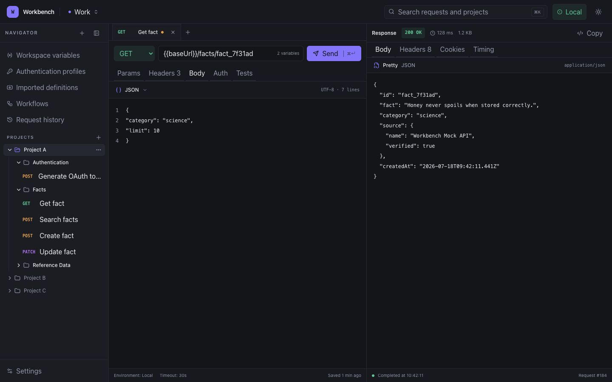

# Workbench

Workbench is a local-first, project-oriented API client for saved requests,
reusable authentication, OpenAPI imports, and developer workflows. It is built
for developers who want the structure of a project workspace without tying
their API collections to a Git repository or a hosted account.

> Workbench is under active development. The repository foundation and product
> shell are in place; functional product areas are delivered through the
> numbered phase issues.

## Why Workbench

- Organise APIs into manually created workspaces, projects, folders, and saved
  requests.
- Execute requests from the server runtime, avoiding browser CORS limitations.
- Resolve scoped environments and variables with visible provenance.
- Reuse authentication and extracted request outputs across requests.
- Preserve OpenAPI definitions as refreshable first-class records.
- Keep application data in a local PostgreSQL database with documented export
  and backup formats.

## Technology

- Next.js 16, React 19, and strict TypeScript
- Tailwind CSS 4 and shadcn-compatible Radix UI components
- PostgreSQL 18 and Drizzle ORM
- Zod validation
- Vitest, React Testing Library, and Playwright
- Docker, Docker Compose, and GitHub Actions

## Current interface



The foundation shell uses generic seeded data while workspace, request, and
execution persistence are delivered in the next product phases. Documentation
screenshots are captured from the running application at a stable 1440×900
viewport and must never contain secrets.

## Quick start

Prerequisites: Docker Desktop or Docker Engine with Compose.

```bash
docker compose up -d
```

Open [http://localhost:3000](http://localhost:3000). Check container state with:

```bash
docker compose ps
docker compose logs -f app
```

Stop the stack without deleting persisted data:

```bash
docker compose down
```

The `workbench_postgres_data` named volume preserves PostgreSQL data across
restarts. Deleting that volume is destructive and is intentionally not part of
the normal shutdown command.

## Local development

Prerequisites: Node.js 24, npm 11, Docker, and Docker Compose.

```bash
npm ci
docker compose up -d database
cp .env.example .env
npm run db:migrate
npm run dev
```

For a containerised development server with bind-mounted source:

```bash
docker compose -f docker-compose.yml -f docker-compose.dev.yml up --build
```

### Environment variables

| Name                | Purpose                               | Default in Compose                   |
| ------------------- | ------------------------------------- | ------------------------------------ |
| `DATABASE_URL`      | Server-only PostgreSQL connection URL | Generated from the PostgreSQL values |
| `POSTGRES_DB`       | Local database name                   | `workbench`                          |
| `POSTGRES_USER`     | Local database user                   | `workbench`                          |
| `POSTGRES_PASSWORD` | Local database password               | `workbench`                          |
| `POSTGRES_PORT`     | Loopback-only database port           | `5432`                               |
| `APP_PORT`          | Host port mapped to the app           | `3000`                               |

The Compose defaults are development-only credentials. Set unique values if the
database is exposed beyond the local Docker network. Never use a `NEXT_PUBLIC_`
variable for secrets.

## Commands

| Command                    | Purpose                                   |
| -------------------------- | ----------------------------------------- |
| `npm run dev`              | Start the local development server        |
| `npm run build`            | Build the production application          |
| `npm run format:check`     | Check formatting                          |
| `npm run lint`             | Run ESLint with no warnings allowed       |
| `npm run typecheck`        | Generate route types and check TypeScript |
| `npm test`                 | Run unit and component tests              |
| `npm run test:integration` | Run PostgreSQL integration tests          |
| `npm run test:e2e`         | Run Playwright browser tests              |
| `npm run db:generate`      | Generate a Drizzle SQL migration          |
| `npm run db:check`         | Validate migration consistency            |
| `npm run db:migrate`       | Apply committed migrations                |
| `npm run check`            | Run the primary local quality gate        |

## Architecture

Workbench is one self-hosted Next.js application backed by PostgreSQL. Browser
code is limited to UI and interaction; database access, secrets, imports, and
outbound HTTP execution stay in the server runtime.

```text
Browser
  ↓
Next.js application
  ├── App Router UI and server endpoints
  ├── Core domain modules
  ├── HTTP and authentication engines
  ├── Import adapters and workflow runner
  └── Drizzle repositories
        ↓
    PostgreSQL
```

See [Architecture](docs/architecture.md), [Data model](docs/data-model.md), and
the [architecture decision records](docs/adr/README.md).

## Testing and security

Tests do not depend on public internet services. Integration and browser tests
use local PostgreSQL and deterministic mock APIs as features are implemented.
The CI pipeline checks formatting, linting, types, unit coverage, components,
migrations, integration behavior, browser flows, the production build, the
container image, and high-severity dependency vulnerabilities.

Workbench is local-first, not security-free. The request engine is designed to
restrict protocols, validate redirects, block cloud metadata destinations,
limit payloads, and redact secrets. Read the [security model](docs/security.md)
before exposing Workbench outside a trusted machine.

## Data export, backup, and upgrades

Versioned export, automatic backup, restore, and upgrade workflows are tracked
in Phase 9. Their committed design is documented in
[Backup and restore](docs/backup-and-restore.md). Do not treat raw PostgreSQL
volume copies from a running database as a supported backup.

## Container images and releases

Merges to `master` publish multi-platform images to:

```text
ghcr.io/josh-uk/workbench
```

Images are tagged with `latest` and the full Git commit SHA. Semantic version
tags such as `v1.0.0` also create versioned images and a GitHub release. The
repository and its packages are private unless the owner changes their
visibility explicitly.

## Contributing

All meaningful changes use feature branches and pull requests. Read
[CONTRIBUTING.md](CONTRIBUTING.md) before making a change. Report security
problems through a private GitHub security advisory, not a public issue.

## Licence

[MIT](LICENSE)
