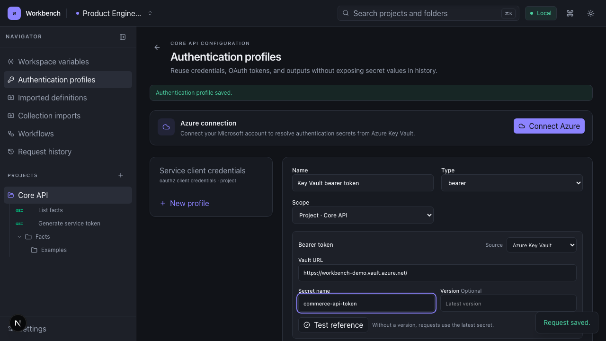
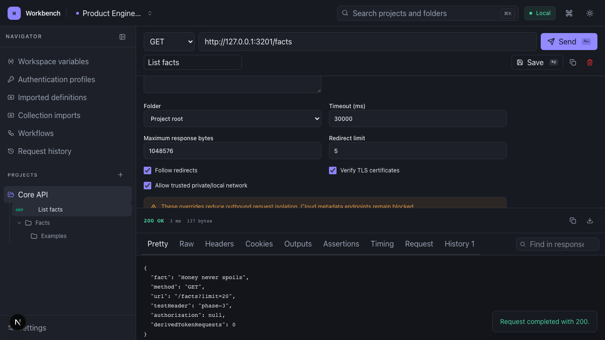
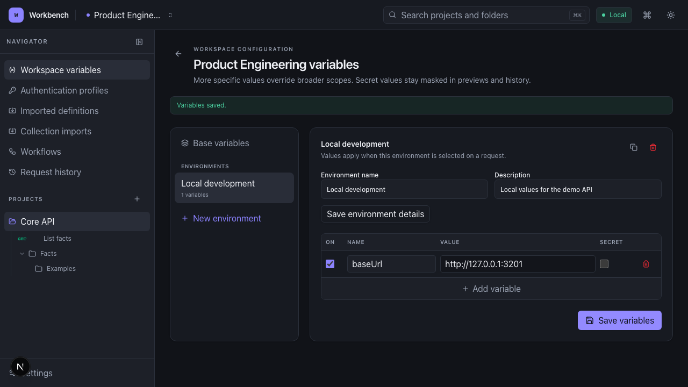
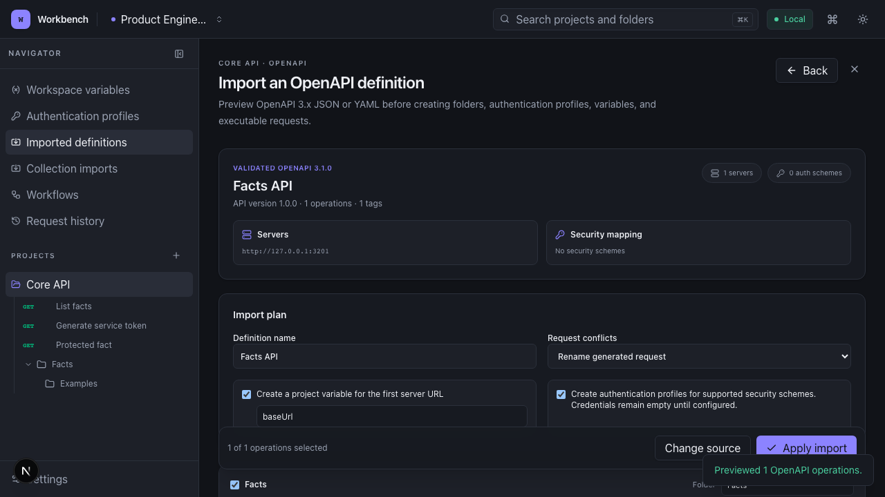
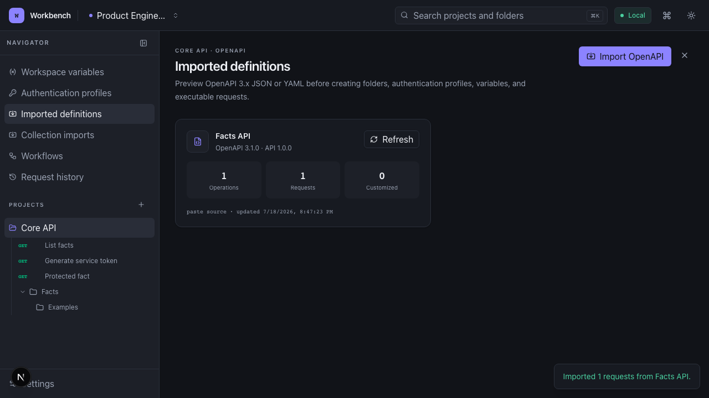
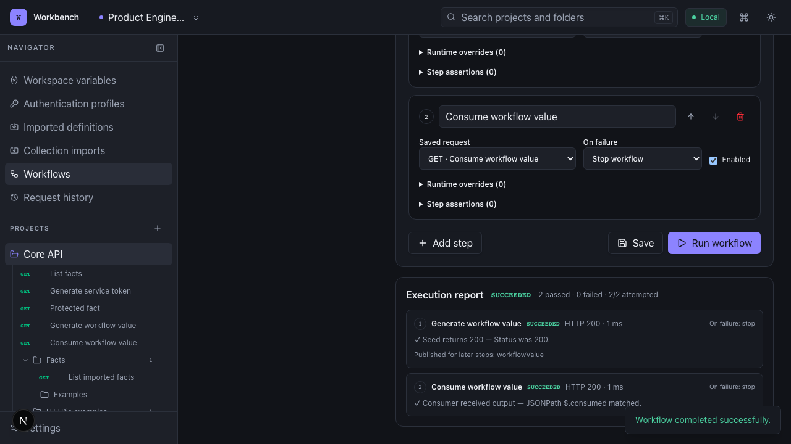
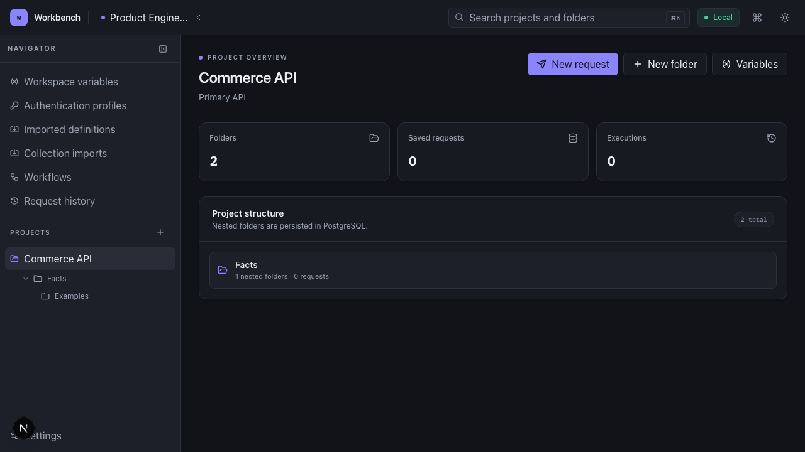
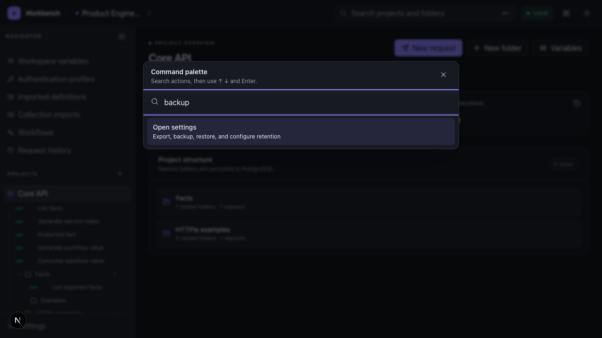

# Workbench

Workbench is a local-first API development client built around reusable
authentication, connected request flows, and durable project organisation. It
runs as a self-hosted Next.js application with PostgreSQL, so collections,
credentials, execution history, imports, and backups remain under your control.

> [!IMPORTANT]
> **Azure Key Vault is built directly into Workbench authentication in v1.1.**
> Connect your personal Microsoft account through a guided, `az login`-style
> flow in the UI, then use Key Vault secrets in authentication profiles. There
> is no terminal login, no user-created Entra application registration, and no
> resolved vault value stored in Workbench.

## Use Azure Key Vault without leaving the app

Workbench can source bearer tokens, Basic-auth passwords, API keys, OAuth client
secrets, OAuth passwords, and OAuth refresh tokens from Azure Key Vault. Pick
**Azure Key Vault** on the credential field, enter the vault URL and secret name,
and optionally pin an exact version. Leaving the version blank follows the
latest secret so normal rotation does not require editing the profile.

The Microsoft device-code flow, connection status, reference test, and
disconnect controls all live on the Authentication screen. Azure CLI is already
included in the standard amd64 and arm64 Docker images, and its isolated session
survives normal Compose container recreation.



[Read the Azure Key Vault setup and security details](docs/authentication.md#connect-azure).

It is designed for developers who need more than isolated HTTP requests:

- resolve authentication secrets from Azure Key Vault only when a request needs
  them;
- obtain a token from one saved request and inject it into another;
- publish response values for later requests and workflows;
- explain exactly which environment or variable supplied a value;
- preserve an OpenAPI definition and refresh it without overwriting local edits;
- run ordered, asserted request flows with persistent reports; and
- export or back up the complete local workspace.

No hosted account is required. Workbench is intended for a trusted local machine
or private development network and does not provide application-level user
authentication.



## What makes Workbench different

### Authentication can be a reusable flow

Authentication is a first-class workspace or project resource, not just a
header field copied between requests. Workbench supports bearer tokens, Basic
auth, API keys, OAuth 2.0 client credentials, password and refresh-token grants,
and request-derived profiles.

| Profile type             | Intended use                                                      |
| ------------------------ | ----------------------------------------------------------------- |
| None                     | Send the request without an authentication profile                |
| Bearer token             | Inject a reusable token into a configurable header                |
| Basic authentication     | Build a Basic header from a reusable username and password        |
| API key · header         | Inject a reusable key into a named request header                 |
| API key · query          | Inject a reusable key into a named query parameter                |
| OAuth client credentials | Obtain and cache a service token with client credentials          |
| OAuth password           | Obtain and refresh a token with user credentials                  |
| OAuth refresh token      | Exchange a configured refresh token for an access token           |
| Request-derived          | Run a saved token request and inject one of its published outputs |

OAuth profiles configure the token endpoint, client identity, scope, audience,
response JSONPaths, injection target, and failure behavior. Access and refresh
tokens are cached server-side and refreshed before expiry.


Credential fields can be stored in Workbench or resolved from Azure Key Vault.
The Authentication screen connects a personal Microsoft account using a guided
device-code flow entirely in the UI—there is no terminal command and no
user-created Microsoft Entra application registration. Workbench supports Key
Vault references for:

| Authentication profile   | Key Vault-backed fields                     |
| ------------------------ | ------------------------------------------- |
| Bearer token             | Token                                       |
| Basic authentication     | Password                                    |
| API key                  | Key value                                   |
| OAuth client credentials | Client ID and client secret                 |
| OAuth password           | Client ID, client secret, and password      |
| OAuth refresh token      | Client ID, client secret, and refresh token |

Each reference identifies a vault URL, secret name, and optional exact version.
Omitting the version follows the latest secret, enabling rotation without
editing the profile. Values are resolved only on the server immediately before
use and never enter Workbench records, history, exports, or backups.

A request-derived profile connects normal saved requests into an authentication
flow:

1. A token request extracts a named value from its JSON response.
2. The output is stored with an optional expiry and marked secret.
3. A reusable profile selects that request and output.
4. A dependent request injects the value into a header or query parameter.
5. Workbench reuses an unexpired value or runs the token request again when
   required.

The same request engine, network policy, expiry handling, cycle detection, and
redaction rules apply throughout. Project profiles can also override individual
fields from a workspace profile without duplicating the shared configuration.


Read [Authentication and request outputs](docs/authentication.md) for the full
profile and token lifecycle.

### Responses become inputs, without exposing secrets

Any successful JSON response can publish named outputs using JSONPath. Outputs
can carry an expiry and secret classification, then participate in later request
resolution or pass from one workflow step to the next. This makes entity IDs,
CSRF tokens, cursors, session values, and generated credentials reusable without
building a separate scripting system.

Variables resolve through explicit layers:

1. temporary runtime override;
2. request variable;
3. generated request output;
4. project environment;
5. project variable;
6. workspace environment; and
7. workspace variable.

The preview shows provenance and unresolved placeholders before execution.
Secret taint propagates through interpolated values, while persisted history,
previews, logs, exports, headers, cookies, and matching response content are
redacted.



Read [Variable resolution](docs/variable-resolution.md) for precedence,
interpolation, provenance, and secret behavior.

### Imports remain connected to their source

OpenAPI 3.x JSON and YAML are previewed before they change a project. Workbench
can create folders, server variables, authentication profiles, and executable
requests while retaining the original definition, operation snapshots, source
hash, import history, and generated-request ownership.



Refreshing a definition presents selective changes. Generated requests that
remain untouched can be updated, while locally customised requests are protected
from silent replacement or deletion and can be detached permanently.



Portable collection imports use the same review-first approach. Workbench
detects HTTPie Desktop/CLI, Postman, cURL, and raw HTTP input, previews supported
records and warnings, then applies rename, replace, merge, or skip decisions in
one transaction.

Read [OpenAPI import](docs/openapi-import.md),
[Importer architecture](docs/importers.md), and
[HTTPie import](docs/httpie-import.md).

### Workflows reuse real saved requests

Workflows execute an ordered list of saved requests through the normal server
request engine. Each step can add temporary variables and assertions, consume
outputs produced earlier in the run, and either stop or continue after failure.

Assertions cover status, duration, headers, response text, JSONPath, bounded
regular expressions, and JSON Schema. Persistent reports retain the outcome,
timing, published output names, and readable failures without recording secret
values.



Read [Workflows and assertions](docs/workflows-and-assertions.md).

## The rest of the product

- **Workspaces and projects:** manually organised projects, nested folders,
  saved requests, archive/restore, duplication, search, and persisted selection.
- **Complete request editor:** query parameters, headers, cookies, body modes,
  tags, notes, request settings, cancellation, and bounded history.
- **Server-side execution:** no browser CORS restriction; status, body, headers,
  cookies, timing, request snapshot, output and assertion results, downloads,
  response search, and redirect details.
- **Network safeguards:** HTTP/HTTPS-only execution, DNS and redirect
  revalidation, cloud metadata blocking, private-target opt-in, timeouts, TLS
  settings, and response-size limits.
- **Portable data:** versioned project/workspace ZIP files, optional encrypted
  secret export, atomic full restore, scheduled backups, and retention controls.
- **Keyboard-first navigation:** a searchable command palette plus shortcuts for
  search, request creation, save, send, and sidebar control.





| Action                 | Shortcut           |
| ---------------------- | ------------------ |
| Open command palette   | `⌘/Ctrl` + `⇧` + P |
| Search navigator       | `⌘/Ctrl` + K       |
| Create request         | `⌘/Ctrl` + N       |
| Save request           | `⌘/Ctrl` + S       |
| Send request           | `⌘/Ctrl` + Enter   |
| Toggle project sidebar | `⌘/Ctrl` + B       |

## Run Workbench

Prerequisite: Docker Desktop or Docker Engine with Compose.

Download or copy [`docker-compose.yml`](docker-compose.yml) into an empty
directory, then start Workbench using the published release image. Cloning the
repository is not required.

```bash
docker compose up -d
```

Open [http://localhost:3000](http://localhost:3000), then check the services with:

```bash
docker compose ps
docker compose logs -f app
```

Stop the stack without deleting data:

```bash
docker compose down
```

The `workbench_postgres_data`, `workbench_backups`, and
`workbench_azure_cli` volumes preserve the database, logical backups, and
optional Azure sign-in respectively. Compose pulls
`ghcr.io/josh-uk/workbench:latest` by default. Set `WORKBENCH_IMAGE` to pin a
version such as `ghcr.io/josh-uk/workbench:1.1.1`. Compose defaults use
development credentials; set unique `POSTGRES_*` values before exposing the
database beyond the local Docker network.

### Container images

Every verified merge to `master` publishes a non-root, multi-platform image for
`linux/amd64` and `linux/arm64`:

```text
ghcr.io/josh-uk/workbench
```

Images receive `latest` and full-commit-SHA tags. Version tags such as `v1.1.1`
also publish semantic-version tags, an SBOM, build provenance, and a GitHub
release. GitHub Container Registry visibility is managed separately from the
public repository.

## Local development

Prerequisites: Node.js 24 LTS, npm 11, Docker, and Docker Compose.

```bash
npm ci
docker compose up -d database
cp .env.example .env
npm run db:migrate
npm run dev
```

For a containerised development server with bind-mounted source:

```bash
docker compose -f docker-compose.yml -f docker-compose.dev.yml up --build
```

### Configuration

| Name                        | Purpose                                        | Compose default                      |
| --------------------------- | ---------------------------------------------- | ------------------------------------ |
| `WORKBENCH_IMAGE`           | Published Workbench image or pinned version    | `ghcr.io/josh-uk/workbench:latest`   |
| `DATABASE_URL`              | Server-only PostgreSQL connection URL          | Generated from the PostgreSQL values |
| `POSTGRES_DB`               | Local database name                            | `workbench`                          |
| `POSTGRES_USER`             | Local database user                            | `workbench`                          |
| `POSTGRES_PASSWORD`         | Local database password                        | `workbench`                          |
| `POSTGRES_PORT`             | Loopback-only database port                    | `5432`                               |
| `APP_PORT`                  | Host port mapped to the application            | `3000`                               |
| `WORKBENCH_BACKUP_DIR`      | Server-only logical backup directory           | `/backups`                           |
| `WORKBENCH_BACKUP_PASSWORD` | Password for encrypted automatic backups (12+) | Empty                                |
| `AZURE_CONFIG_DIR`          | Isolated Azure CLI authentication state        | `/home/nextjs/.azure`                |

Never use a `NEXT_PUBLIC_` variable for a secret.

### Quality commands

| Command                      | Purpose                                   |
| ---------------------------- | ----------------------------------------- |
| `npm run check`              | Primary local quality and production gate |
| `npm run test:unit:coverage` | Run unit tests with coverage              |
| `npm run test:component`     | Run accessible component interactions     |
| `npm run test:integration`   | Run isolated PostgreSQL integration tests |
| `npm run test:e2e`           | Run Playwright and Axe browser flows      |
| `npm run screenshots`        | Regenerate the documentation screenshots  |
| `npm run db:check`           | Validate migration consistency            |
| `npm run db:migrate`         | Apply committed migrations                |

CI requires formatting, linting, strict type checks, unit coverage, component
tests, migration validation, PostgreSQL integration tests, Playwright/Axe, a
production build, dependency audit, and the two-platform container build before
a pull request can be merged.

## Architecture and operations

Workbench is one self-hosted Next.js application backed by PostgreSQL. Browser
code handles interaction; database access, secrets, imports, authentication,
backup operations, and outbound HTTP execution remain in the server runtime.

```text
Browser
  ↓
Next.js application
  ├── App Router UI and validated server boundaries
  ├── Request, authentication, variable, and assertion engines
  ├── Import adapters, workflow runner, and backup services
  └── Drizzle repositories
        ↓
    PostgreSQL
```

Start with:

- [Architecture](docs/architecture.md)
- [Data model](docs/data-model.md)
- [Request execution](docs/request-execution.md)
- [Backup and restore](docs/backup-and-restore.md)
- [Security model](docs/security.md)
- [Testing strategy](docs/testing.md)
- [Release readiness](docs/release-readiness.md)
- [Architecture decisions](docs/adr/README.md)

Release history is recorded in [CHANGELOG.md](CHANGELOG.md). Contributions use
protected, rebase-merged pull requests; see [CONTRIBUTING.md](CONTRIBUTING.md).
Report vulnerabilities through a private GitHub security advisory rather than a
public issue.

## Licence

MIT © 2026 [josh-uk](https://github.com/josh-uk). See [LICENSE](LICENSE).
