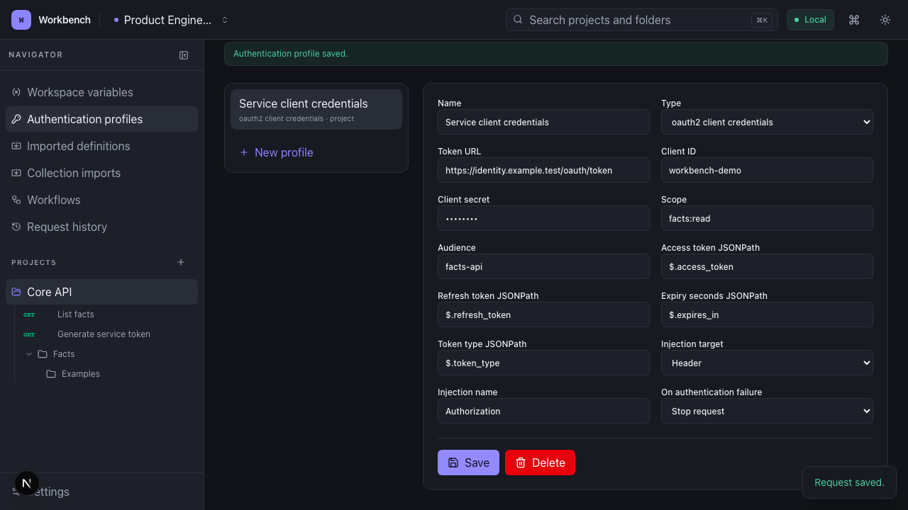
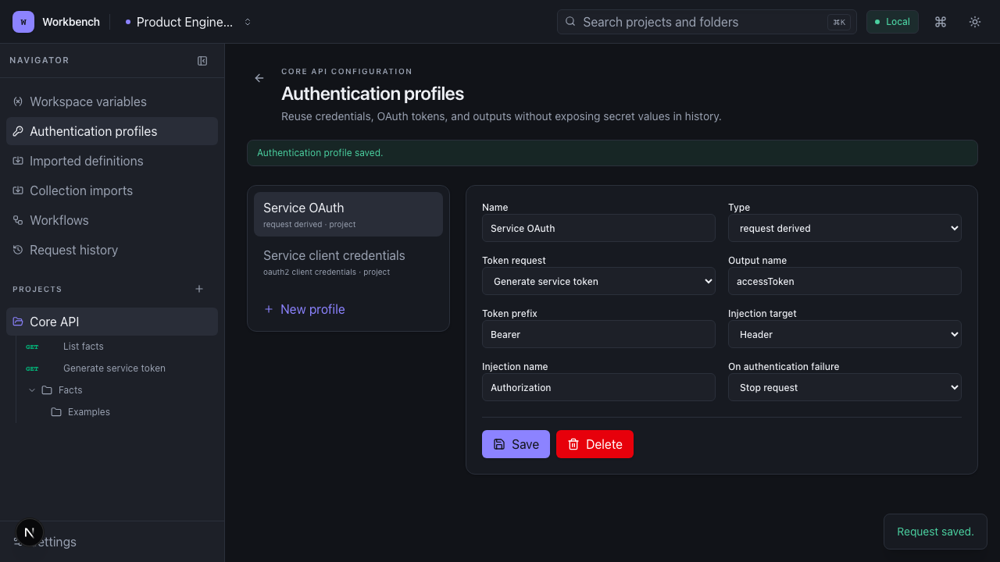

# Authentication and request outputs

Authentication profiles live at workspace or project scope. A project can use
its own profiles, inherit workspace profiles, and save field-level configuration
overrides without changing the shared profile. The request editor lists every
profile available to its project.

## Supported profiles

- No authentication
- Bearer token
- Basic authentication
- API key in a header or query parameter
- OAuth 2.0 client credentials
- OAuth 2.0 password grant
- OAuth 2.0 refresh-token grant
- Request-derived authentication backed by a saved request output

Profile fields support the same `{{variable}}` interpolation as requests. Direct
OAuth profiles accept a token URL, client credentials, scope, audience, token
response JSONPaths, injection target, and failure behavior. OAuth token endpoints
run through the normal protocol, DNS, redirect, private-network, metadata,
timeout, TLS, and response-size controls.

## Token lifecycle

Workbench keeps one server-side cache entry per OAuth profile. It reuses a token
until 30 seconds before its expiry. On expiry it uses the cached or configured
refresh token when available; otherwise it repeats the configured grant. Editing
a profile or project override clears the relevant cache. Token values never enter
the browser DTO, execution snapshot, response history, or application log.

A request-derived profile identifies a saved token request and one of that
request's named outputs. Before a dependent request runs, Workbench:

1. checks for the newest unexpired output;
2. executes the token request through the same server-side engine when needed;
3. extracts and stores its outputs;
4. injects the selected output into a header or query parameter; and
5. records only the profile, source, target, and a masked credential in history.

Dependency cycles fail before another socket is opened. The default failure mode
stops the dependent request; a profile can explicitly continue without
authentication instead.

## General request outputs

The Outputs tab publishes named values from a successful JSON response. Each
definition contains a name, JSONPath, optional JSONPath containing lifetime in
seconds, and a secret flag. Supported JSONPath forms include root (`$`), property
access, quoted bracket properties, array indexes, and wildcards.

The newest unexpired output with a given name becomes a generated variable for
later requests in the same project. It resolves between environment/project
values and request/runtime values. This supports entity IDs, CSRF tokens,
pagination cursors, session values, and OAuth tokens without an
authentication-specific data path.

Secret output values are masked in the output viewer and redacted from response
body previews and headers before persistence. Output definitions and profile
references are deep-copied with requests, projects, and workspaces; live token
caches and historical output values are deliberately not copied.

## Trust boundary

Reusable credentials and tokens are stored in local PostgreSQL so they can be
used by the server. Database access is therefore inside the trusted local
boundary. Workbench does not claim operating-system keychain or at-rest database
encryption; protect the host and database and do not expose them to untrusted
networks.
