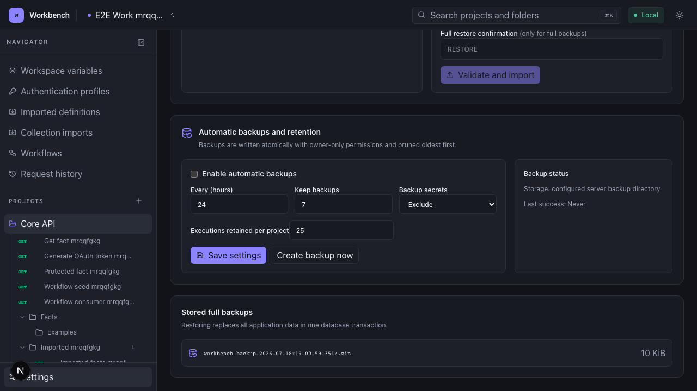

# Backup and restore

Open **Settings → Export, backup, and restore** to download a workspace or
project, import an archive, create a full backup, configure automatic backups,
or restore a stored backup. These are logical application archives rather than
raw PostgreSQL volume copies.



## Version 1 archive

Every `.zip` contains:

```text
manifest.json
data.json
secrets.json       # only for an explicitly confirmed plain-text export
secrets.json.enc   # only for a password-protected export
```

The manifest records the archive kind, format and database-schema versions,
creation time, scope, secret mode, record counts, and SHA-256 checksum for each
payload. Import accepts only declared top-level paths, checks compressed,
per-file, and expanded size limits, validates all counts and checksums, filters
unknown columns, and rejects missing relationships. Version 1 currently
requires the matching `0003_fresh_tana_nile` logical schema.

Workspace and project imports generate new UUIDs and remap all relationships.
They never overwrite the source record; a collision receives a `copy` name.
Project imports require a destination workspace. Full restore preserves IDs and
replaces all application data inside one PostgreSQL transaction. If any insert
or foreign-key check fails, PostgreSQL rolls the complete restore back.

## Secrets

The default mode excludes marked variables, secret headers, authentication
credentials and overrides, cached tokens, secret runtime outputs, workflow
secret overrides, import source documents, request snapshots, response
headers/cookies/body previews, and persisted error details. Their structural
records remain, with the sensitive values empty.

Encrypted mode stores those values in an authenticated AES-256-GCM payload. A
32-byte key is derived from the user password with scrypt; a random salt, nonce,
and authentication tag are stored with the ciphertext. Passwords must contain
at least 12 characters and are never written to PostgreSQL or application logs.
Losing an archive password makes its secrets unrecoverable.

Plain-text mode requires a prominent confirmation and adds a manifest warning.
Anyone who can read that archive can read its credentials.

## Automatic backups

The production server checks the persisted schedule once a minute and creates a
timestamped full archive when it is due. Files are written to a temporary file,
renamed atomically, assigned owner-only `0600` permissions, and pruned oldest
first to the configured count. The directory is `WORKBENCH_BACKUP_DIR`; Compose
sets it to `/backups` on the persistent `workbench_backups` volume.

Automatic backups support excluded or encrypted secrets. For encrypted mode,
set `WORKBENCH_BACKUP_PASSWORD` to at least 12 characters before enabling the
schedule. Rotating that environment value does not re-encrypt older backups, so
retain the old password while those archives are still needed.

## Restore procedure

1. Create a fresh full backup and verify it appears under **Stored full
   backups**.
2. Select the target backup.
3. Enter its password if it is encrypted.
4. Type `RESTORE` exactly.
5. Start the restore and wait for the success message before restarting or
   closing the server.

Uploaded full archives use the same confirmation. A restore audit summary is
stored as `backup.lastRestore`; it contains timestamps, kind, and record count,
not secret data.

Raw copies of a live PostgreSQL data directory are not a supported backup.
